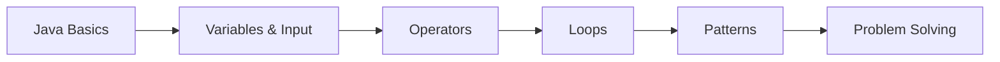

# ☕ Java Tutorials

A beginner-friendly Java practice repository containing small programs for learning fundamental programming concepts through simple examples.


## 🖼️ Learning Flow



## 📚 Current Examples

### `STAR.java`
Prints a right-triangle star pattern using **nested `for` loops**.

Example output:

```text
*
**
***
****
*****
```

### `Swap.java`
Reads two integers and demonstrates swapping their values using arithmetic operations instead of a temporary variable.

> The multiplication/division technique requires non-zero values and can overflow for large integers; it is included here as a learning example rather than the preferred production technique.

## 🧰 Technology


## 🚀 Compile & Run

```bash
javac STAR.java
java STAR
```

Or:

```bash
javac Swap.java
java Swap
```

## 🎯 Learning Goals

- Understand Java program structure and `main()`.
- Practice variables and console input with `Scanner`.
- Learn nested loops and pattern printing.
- Understand arithmetic operators and basic problem solving.

## 🔄 Continuous Validation

Every push and pull request automatically compiles both Java examples using **GitHub Actions**. This keeps the learning repository continuously checked for basic build errors.

## 📌 Status

Ongoing Java learning repository.

## 👨‍💻 Author

**Dreamjain** — [GitHub](https://github.com/Dreamjain)
